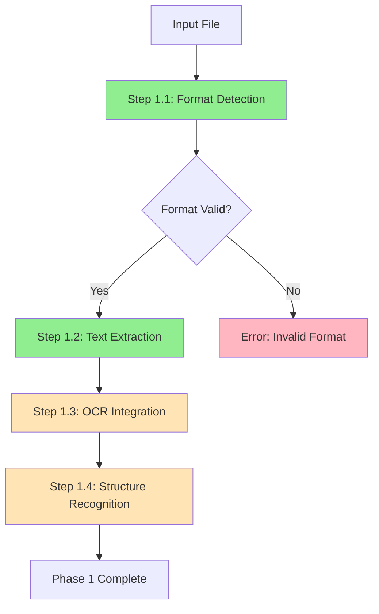

# Phase 1: Text Extraction & Format Processing

## Overview

Phase 1 is the foundation of the book cleaning pipeline, responsible for extracting and processing text from various file formats. This phase transforms raw input files into structured, clean text ready for further processing.

## Architecture

Phase 1 follows a hierarchical step-by-step architecture:

```
Phase 1: Text Extraction & Format Processing
├── Step 1.1: File Format Detection & Validation
├── Step 1.2: Text Extraction Based on Book Structure
├── Step 1.3: OCR Integration & Text Comparison (Phase 2)
└── Step 1.4: Structure Recognition & Analysis (Phase 2)
```

## Current Implementation Status

| Step | Status | Description |
|------|--------|-------------|
| **Step 1.1** | ✅ Complete | File format detection and validation |
| **Step 1.2** | ✅ Complete | Text extraction based on book structure |
| **Step 1.3** | 🔄 Placeholder | OCR integration and text comparison |
| **Step 1.4** | 🔄 Placeholder | Structure recognition and analysis |

## Phase Orchestration

The `DataLoadingPhase` class orchestrates all steps in this phase:

```typescript
import { DataLoadingPhase } from './DataLoadingPhase';
import { LoggerService } from '../../services/LoggerService';

const logger = new LoggerService(config);
const phase = new DataLoadingPhase(logger);

const result = await phase.execute(pipelineState, progressCallback);
```

## Step Integration

### Step 1.1: File Format Detection & Validation
- **Input**: File path and basic file info
- **Output**: Validated format with confidence score
- **Status**: Production ready
- **Features**: Magic number detection, security validation, format-specific checks

### Step 1.2: Text Extraction Based on Book Structure  
- **Input**: File info + book structure configuration
- **Output**: Extracted text with boundaries applied
- **Status**: Production ready
- **Features**: Page-based and text-based boundary extraction, user prompts

### Step 1.3: OCR Integration & Text Comparison
- **Input**: Extracted text + file for OCR processing
- **Output**: Best quality text (embedded vs OCR vs hybrid)
- **Status**: Placeholder (Phase 2)
- **Features**: OCR processing, text comparison, smart selection

### Step 1.4: Structure Recognition & Analysis
- **Input**: Final text from previous steps
- **Output**: Document structure with chapters and hierarchy
- **Status**: Placeholder (Phase 2)
- **Features**: Chapter detection, heading analysis, metadata extraction

## Data Flow



## File Organization

Following the established architecture pattern:

```
phase_1_Text_Extraction_And_Format_Processing/
├── DataLoadingPhase.ts              # Phase orchestrator
├── PhaseExecutionSummary.ts          # Phase execution tracking
├── index.ts                          # Phase exports
├── README.md                         # This file
├── step_1_File_Format_Detection_And_Validation/
│   ├── FileFormatDetector.ts         # Main implementation
│   ├── ExecutionSummary.ts           # Step execution tracking
│   ├── index.ts                      # Step exports
│   └── README.md                     # Step documentation
├── step_2_Text_Extraction/
│   ├── TextExtractor.ts              # Main implementation
│   ├── ExecutionSummary.ts           # Step execution tracking
│   ├── index.ts                      # Step exports
│   └── README.md                     # Step documentation
├── step_3_OCR_Integration/
│   ├── OCRService.ts                 # OCR processing (placeholder)
│   ├── TextComparator.ts             # Text comparison (placeholder)
│   ├── SmartTextSelector.ts          # Text selection (placeholder)
│   ├── ExecutionSummary.ts           # Step execution tracking
│   ├── index.ts                      # Step exports
│   └── README.md                     # Step documentation
└── step_4_Structure_Recognition/
    ├── ChapterRecognizer.ts          # Chapter detection (placeholder)
    ├── ExecutionSummary.ts           # Step execution tracking
    ├── index.ts                      # Step exports
    └── README.md                     # Step documentation
```

## Configuration

Phase 1 uses book-specific configuration files:

```yaml
# book-structure/Author#Title.yaml
author: "Author Name"
title: "Book Title"
first-author-content-page: 5
last-author-content-page: 120
# or for non-paginated files:
text-before-first-chapter: "INTRODUCTION"
text-after-last-chapter: "APPENDIX"
```

## Error Handling

Phase 1 implements comprehensive error handling:

- **Format Detection Errors**: Unsupported formats, corrupted files
- **Extraction Errors**: Missing boundaries, invalid structure
- **OCR Errors**: Processing failures, timeout issues (Phase 2)
- **Structure Errors**: Invalid hierarchy, missing chapters (Phase 2)

## Performance Considerations

### Memory Management
- Streaming for large files
- Efficient text processing
- Resource cleanup after each step

### Processing Speed
- Parallel step execution where possible
- Optimized format detection
- Cached configuration loading

## Testing

### Unit Tests
```bash
npm run test:phase1
```

### Integration Tests
```bash
npm run test:phase1-integration
```

### End-to-End Tests
```bash
npm run test:phase1-e2e
```

## Execution Tracking

Phase 1 provides detailed execution tracking:

```typescript
const summary = createPhase1ExecutionSummary(filePath, fileSize, format);

// Track individual steps
const updatedSummary = updatePhase1ExecutionSummaryWithStep(
  summary, 
  "step1_1", 
  step1Summary
);

// Track final results
const finalSummary = updatePhase1ExecutionSummary(
  updatedSummary,
  textLength,
  detectedFormat,
  success,
  structureDetected,
  confidence
);
```

## Future Enhancements

### Phase 2 Development
- **OCR Integration**: Tesseract.js implementation
- **Text Comparison**: Advanced similarity algorithms
- **Smart Selection**: AI-powered text quality assessment
- **Structure Recognition**: Machine learning-based chapter detection

### Advanced Features
- **Multi-format Support**: Additional file formats
- **Parallel Processing**: Concurrent step execution
- **Caching**: Intelligent result caching
- **Progress Streaming**: Real-time progress updates

## Integration with Other Phases

Phase 1 output feeds into:
- **Phase 2**: Text normalization and AI cleaning
- **Phase 3**: Evaluation and analysis
- **Phase 4**: AI enhancements and metadata generation

## CLI Integration

Phase 1 is automatically executed as part of the main pipeline:

```bash
npm run dev clean-book input.pdf --output-dir ./output --verbose
```

The phase respects all CLI options and provides detailed logging and progress reporting.

## Status and Roadmap

**Current Status**: Production ready for Steps 1.1 and 1.2  
**Next Release**: Phase 2 with OCR integration and structure recognition  
**Target**: Full Phase 1 completion with all four steps operational

Phase 1 establishes the foundation for the entire book cleaning pipeline, ensuring reliable text extraction and format processing across all supported file types. 